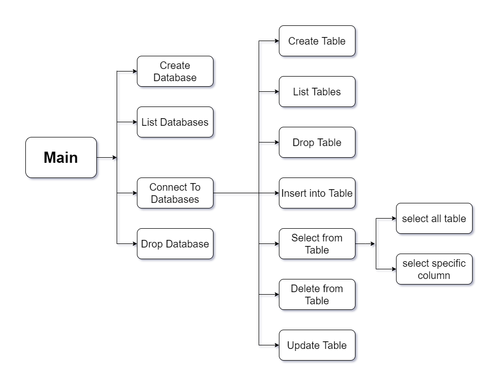

<h1 align="center"> Bash Project </h1>


## Project Description   :  
<p align="center">
The Project aim to develop DBMS that will enable users to store and retrieve the data from Hard-disk. 
</p>
<p align="center">
  
</p>

## To install the project :   

```console
wget https://github.com/aomarabdelaziz/DevOps-bash-project/blob/master/install.sh
sudo chmod +x install.sh
sudo bash install.sh
```

## To run this project  :   

```console
dbms-run
```

## To rum mandb project  :   

```console
man dbms    
```

## Contributors
<table>
   <tr>
    <td>
      </img>
    </td>
    <td>
      </img>
    </td>
  </tr>
  <tr>
    <td>
      <a href="https://github.com/aomarabdelaziz"> Abdelaiz Omar </a>
    </td>
     <td>
      <a href="https://github.com/mahmouddahaby"> Mahmoud Dahby </a>
    </td>
  </tr>
</table>
